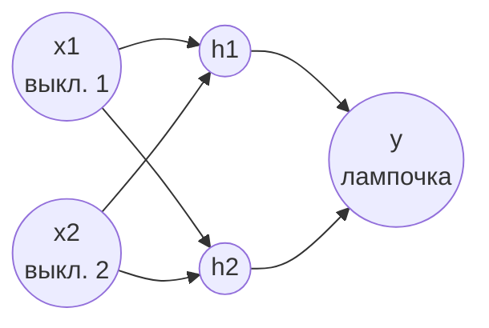

## Часть 1. Какой вопрос будет решать сеть

Представьте коридор с лампочкой, которую можно включить и выключить **с двух разных выключателей** — такая схема часто встречается в длинных коридорах или на лестницах. Это называется "проходной выключатель". У него есть простое и универсальное правило:

> Лампочка горит, если положения выключателей **разные**. Если оба выключателя в одном и том же положении — лампочка не горит.

Это и есть функция **XOR** (исключающее ИЛИ), с которой мы уже встречались. Вопрос, на который должна научиться отвечать наша сеть: _"Выключатель 1 в положении $x_1$, выключатель 2 в положении $x_2$ — будет ли гореть лампочка?"_

Мы уже убедились на практике: **один нейрон с этой задачей не справляется**, какую бы функцию активации ни брать — сигмоиду, tanh или ReLU. Максимум, что может один нейрон — ответить правильно в трёх случаях из четырёх. Причина не в "качестве" нейрона, а в том, что один нейрон способен провести только одну прямую линию, разделяющую два класса ответов, а точки XOR на графике расположены по диагонали — одной прямой их не разделить.

Сейчас мы построим сеть из нескольких нейронов, которая эту задачу решает полностью — и, что особенно важно, **никто не будет объяснять сети правило "лампочка горит, если положения разные"**. Сеть увидит только примеры — пары "какие были выключатели → горела ли лампочка" — и сама найдёт закономерность. В этом и состоит отличие машинного обучения от обычного программирования.

---

## Часть 2. Архитектура сети: из каких частей она состоит

Один нейрон — это один "голос" в принятии решения. Чтобы получить более сложное поведение, нейроны объединяют в **слои**, и каждый нейрон следующего слоя получает на вход **выходы всех нейронов предыдущего слоя**, а не исходные данные напрямую.

Наша сеть состоит из трёх слоёв:



- **Входной слой** — это не настоящие нейроны, а просто сами данные: $x_1$ и $x_2$, по одному на каждый выключатель. Значение $0$ означает одно положение выключателя, $1$ — другое (какое именно "0", а какое "1" — не важно, важна лишь согласованность данных).
- **Скрытый слой** — два нейрона, $h_1$ и $h_2$. Он называется "скрытым", потому что его значения не видны ни на входе, ни на выходе сети — это внутренние, промежуточные вычисления. Каждый из этих двух нейронов получает **оба** значения $x_1$ и $x_2$ и у каждого — свои собственные веса.
- **Выходной слой** — один нейрон $y$, который получает на вход не $x_1, x_2$ напрямую, а выходы скрытых нейронов $h_1, h_2$, и выдаёт финальный ответ: число от $0$ до $1$ — "насколько сеть уверена, что лампочка горит".

Именно наличие скрытого слоя и даёт сети возможность построить не одну прямую, а **комбинацию из нескольких прямых**, что в сумме и создаёт изогнутую, более гибкую границу решения — ту самую, что нужна для XOR.

---

## Часть 3. Параметры сети: что такое веса, смещения — и почему именно такие числа

### 3.1 Сколько всего параметров и откуда они берутся

У каждой связи между нейронами — свой вес, и у каждого нейрона (кроме входных "нейронов", которые просто хранят данные) — своё смещение (bias). Пересчитаем для нашей сети:

- связей от входов к скрытому слою: $2$ входа $\times$ $2$ скрытых нейрона $=$ **4 веса**, обозначаются $w^{(1)}_{ji}$ — вес от входа $i$ к скрытому нейрону $j$;
- смещений скрытого слоя: по одному на нейрон — **2 смещения**, $b^{(1)}_j$;
- связей от скрытого слоя к выходу: $2$ скрытых нейрона $\times$ $1$ выход $=$ **2 веса**, $w^{(2)}_{j}$;
- смещение выходного нейрона: **1 смещение**, $b^{(2)}$.

Итого — **9 настраиваемых чисел**. Ни одно из них не задаётся человеком вручную — все девять сеть подберёт сама в процессе обучения. Человек задаёт только **начальные** значения, с которых обучение стартует.

### 3.2 Почему начальные веса — маленькие случайные числа, а не нули

Может показаться логичным начать с весов, равных $0$ — "чистый лист". Но в случае с несколькими нейронами в одном слое это — серьёзная ошибка, и вот почему.

Если $w^{(1)}_{11} = w^{(1)}_{12} = w^{(1)}_{21} = w^{(1)}_{22} = 0$, то при любом входе оба скрытых нейрона $h_1$ и $h_2$ получат на вход одно и то же число ($0$), выдадут одно и то же число на выходе, и — что самое важное — в процессе обучения получат **абсолютно одинаковую коррекцию весов**. Они навсегда останутся "близнецами", дублирующими друг друга, и фактически будут работать как один нейрон, а не как два. Эта проблема называется **симметрией** — обучение не может её нарушить самостоятельно, если оно не было нарушено с самого начала.

Поэтому начальные веса берутся **случайными небольшими числами** (в нашем коде — равномерно от $-1$ до $1$): это гарантирует, что два скрытых нейрона с самого начала немного отличаются друг от друга и в процессе обучения могут "специализироваться" на разных аспектах задачи — например, один может научиться реагировать в основном на $x_1$, другой — больше на $x_2$.

### 3.3 Почему начальные смещения — именно ноль

Смещение, в отличие от весов, можно смело начинать с нуля — симметрии между нейронами это не создаёт (она определяется весами, а не смещениями), а ноль — нейтральная отправная точка, не сдвигающая решение заранее ни в какую сторону.

### 3.4 Почему входы — именно $0$ и $1$

Входные данные кодируют состояние выключателя: два возможных положения превращаются в два числа. Выбор именно $0$ и $1$ (а не, скажем, $-1$ и $1$, что тоже иногда используется на практике) — простое и общепринятое соглашение для "да/нет"-признаков. Числа сами по себе не несут смысла "выключен" или "включён" — смысл им придаёт только то, что мы договорились считать так.

### 3.5 Скорость обучения (learning rate)

В этой сети используется $\eta = 1.0$. Это больше, чем значения $0.1$–$0.5$, которые мы использовали для одного нейрона — многослойным сетям с сигмоидой часто требуется более крупный шаг, чтобы обучение не "застревало" слишком надолго на плато (к этому плато мы ещё вернёмся в части 6).

---

## Часть 4. Прямой проход (forward pass): как рождается самый первый, ещё необученный ответ

Прежде чем сеть обучена, она уже способна выдать какой-то ответ — просто этот ответ бессмысленный, потому что веса случайны. Проследим это на реальном примере.

Возьмём конкретные начальные веса (полученные случайным образом перед обучением):

$$ w^{(1)} = \begin{pmatrix} -0.3523 & -0.6983 \ 0.3019 & -0.8551 \end{pmatrix}, \quad b^{(1)} = \begin{pmatrix} 0 \ 0 \end{pmatrix}, \quad w^{(2)} = \begin{pmatrix} 0.0718 \ -0.2686 \end{pmatrix}, \quad b^{(2)} = 0 $$

(первая строка $w^{(1)}$ — веса, идущие к нейрону $h_1$: от $x_1$ вес $-0.3523$, от $x_2$ вес $-0.6983$; вторая строка — веса, идущие к $h_2$)

Подадим на вход $x_1 = 1,\ x_2 = 0$ (один выключатель включен, другой нет — лампочка **должна** загореться, правильный ответ $y=1$).

**Шаг 1. Вычисляем взвешенные суммы скрытого слоя.**

$$ z^{(1)}_1 = w^{(1)}_{11}x_1 + w^{(1)}_{12}x_2 + b^{(1)}_1 = (-0.3523)(1) + (-0.6983)(0) + 0 = -0.3523 $$

$$ z^{(1)}_2 = w^{(1)}_{21}x_1 + w^{(1)}_{22}x_2 + b^{(1)}_2 = (0.3019)(1) + (-0.8551)(0) + 0 = 0.3019 $$

**Шаг 2. Применяем сигмоиду к каждому скрытому нейрону.**

$$ a^{(1)}_1 = \sigma(-0.3523) \approx 0.4128, \qquad a^{(1)}_2 = \sigma(0.3019) \approx 0.5749 $$

**Шаг 3. Вычисляем взвешенную сумму выходного нейрона — уже не из $x$, а из выходов скрытого слоя.**

$$ z^{(2)} = w^{(2)}_1 a^{(1)}_1 + w^{(2)}_2 a^{(1)}_2 + b^{(2)} = (0.0718)(0.4128) + (-0.2686)(0.5749) + 0 \approx -0.1248 $$

**Шаг 4. Применяем сигмоиду — получаем итоговый ответ сети.**

$$ a^{(2)} = \sigma(-0.1248) \approx 0.4688 $$

**Ответ необученной сети: $0.4688$.** Правильный ответ — $1$ (лампочка должна гореть). Сеть выдала число, близкое к $0.5$ — то есть фактически "не знаю, подброшу монетку". Это ожидаемо: веса случайны, сеть ещё ничему не научилась, её текущий ответ не несёт никакой информации о реальном правиле XOR. Обучение — это процесс, который превратит эти случайные веса в осмысленные.

---

## Часть 5. Обучение: как сеть находит правильные веса сама

### 5.1 Идея в двух предложениях

Сеть делает прямой проход (часть 4), сравнивает полученный ответ с правильным и вычисляет ошибку. Дальше эта ошибка "течёт" обратно через сеть — от выходного нейрона к скрытым — и каждый вес получает свою персональную маленькую коррекцию, пропорциональную тому, насколько именно этот вес виноват в ошибке. Этот процесс называется **методом обратного распространения ошибки** (backpropagation).

### 5.2 Почему ошибку нужно распространять "назад"

Веса выходного нейрона ($w^{(2)}$) напрямую связаны с ошибкой — их легко поправить: мы точно знаем, насколько выход ошибся, и видим, какие именно $a^{(1)}_1, a^{(1)}_2$ привели к этой ошибке.

Но веса скрытого слоя ($w^{(1)}$) не связаны с ошибкой напрямую — между ними и итоговым ответом стоит ещё один слой вычислений. Чтобы понять, насколько, скажем, вес $w^{(1)}_{11}$ виноват в итоговой ошибке, нужно пройти по цепочке: этот вес влияет на $z^{(1)}_1$ → которое влияет на $a^{(1)}_1$ → которое влияет на $z^{(2)}$ → которое влияет на итоговый ответ → который и даёт ошибку. Математический инструмент, который позволяет аккуратно "пройти" по такой цепочке влияний и посчитать итоговый вклад, называется **цепным правилом дифференцирования**. Разбирать его в полной строгости не будем — для практической работы достаточно понимать итоговый результат в виде формул ниже.

### 5.3 Формулы обновления

**Для выходного нейрона** (ошибка здесь вычисляется напрямую):

$$ \delta^{(2)} = (a^{(2)} - y)\cdot \sigma'(z^{(2)}) $$

$$ w^{(2)}_j \leftarrow w^{(2)}_j - \eta\cdot \delta^{(2)}\cdot a^{(1)}_j, \qquad b^{(2)} \leftarrow b^{(2)} - \eta\cdot \delta^{(2)} $$

**Для скрытого слоя** (ошибка "приходит" из выходного слоя через веса $w^{(2)}$):

$$ \delta^{(1)}_j = \delta^{(2)}\cdot w^{(2)}_j \cdot \sigma'(z^{(1)}_j) $$

$$ w^{(1)}_{ji} \leftarrow w^{(1)}_{ji} - \eta\cdot \delta^{(1)}_j\cdot x_i, \qquad b^{(1)}_j \leftarrow b^{(1)}_j - \eta\cdot \delta^{(1)}_j $$

### Новые обозначения

|Символ|Название|Значение|
|---|---|---|
|$w^{(1)}_{ji}$|вес первого слоя|От входа $i$ к скрытому нейрону $j$|
|$w^{(2)}_j$|вес второго слоя|От скрытого нейрона $j$ к выходу|
|$z^{(1)}_j,\ a^{(1)}_j$|сумма и активация скрытого нейрона $j$|Промежуточные вычисления скрытого слоя|
|$z^{(2)}, a^{(2)}$|сумма и активация выходного нейрона|Финальный ответ сети — это $a^{(2)}$|
|$\delta^{(2)}$|"ошибка" выходного нейрона|Сколько и в какую сторону нужно поправить выходной слой|
|$\delta^{(1)}_j$|"ошибка", дошедшая до скрытого нейрона $j$|Доля общей ошибки, за которую отвечает именно этот скрытый нейрон|

Разберите формулу $\delta^{(1)}_j = \delta^{(2)}\cdot w^{(2)}_j \cdot \sigma'(z^{(1)}_j)$ по смыслу каждого множителя: $\delta^{(2)}$ — "сколько вообще было ошибки на выходе"; $w^{(2)}_j$ — "насколько сильно именно этот скрытый нейрон был связан с выходом" (если вес мал — нейрон почти не влиял на ответ, и ошибка на него почти не "перекладывается"); $\sigma'(z^{(1)}_j)$ — "насколько сам скрытый нейрон восприимчив к изменениям" (та же идея насыщения, что и в [[Функции активации - Лекция]]).

---

## Часть 6. Обучаем сеть и смотрим, как меняются её ответы по эпохам

Полный код сети — в части 7. Здесь — результат реального запуска: сеть обучается на всех четырёх примерах XOR, и после каждой контрольной эпохи мы спрашиваем её ответ на все четыре комбинации входов.

|Эпоха|Ответ на $(0,0)$|Ответ на $(0,1)$|Ответ на $(1,0)$|Ответ на $(1,1)$|Средняя ошибка (loss)|
|---|---|---|---|---|---|
|0 (до обучения)|0.475|0.486|0.469|0.480|—|
|1|0.476|0.486|0.469|0.480|0.27289|
|10|0.488|0.497|0.483|0.492|0.27008|
|100|0.502|0.510|0.506|0.513|0.26961|
|500|**0.140**|**0.571**|**0.775**|**0.578**|0.15735|
|2000|0.028|0.969|0.969|0.039|0.00108|
|10000|0.011|0.989|0.989|0.014|0.00014|

Правильные ответы: $(0,0)\to 0$, $(0,1)\to 1$, $(1,0)\to 1$, $(1,1)\to 0$.

### Как это читать

**Эпохи 0–100: сеть практически не меняется.** Все четыре ответа крутятся около $0.5$ — сеть фактически "гадает", и её ошибка почти не снижается ($0.273 \to 0.270$). На этом участке обучение выглядит так, будто оно вообще не происходит.

**Около эпохи 500: происходит резкий сдвиг.** Ответы расходятся в разные стороны: на $(0,0)$ падает до $0.14$, на $(1,0)$ подскакивает до $0.775$. Это и есть момент, когда скрытые нейроны наконец "нашли" разные роли и начали выходить из области, где они почти не отличались друг от друга.

**К эпохе 2000–10000: сеть уверенно отвечает правильно.** Ответы на $(0,1)$ и $(1,0)$ — около $0.97$–$0.99$ (уверенное "да, лампочка горит"), ответы на $(0,0)$ и $(1,1)$ — около $0.01$–$0.03$ (уверенное "нет, не горит"). Задача, недоступная одному нейрону, полностью решена двумя скрытыми нейронами.

### Визуализация той же динамики

![[mlp_xor_loss.png]]

На графике отчётливо виден "плоский" участок примерно до 400-й эпохи (отмечен цветом) — то самое время, когда сеть как будто не учится, — за которым следует резкое падение ошибки.

> [!tip] Почему так происходит — простая аналогия Представьте, что вы ищете выход из тёмной комнаты на ощупь. Первое время вы натыкаетесь на стены почти наугад — кажется, что прогресса нет. Но на самом деле вы постепенно строите в голове карту комнаты, и в какой-то момент внезапно нащупываете дверь — и дальше уже уверенно идёте к ней. "Плато" в обучении — это время, когда сеть ещё не нашла полезное направление в пространстве весов, а резкое падение ошибки — момент, когда направление найдено.

---

## Часть 7. Полный код

Код разбит на два файла. Первый — сама сеть, с подробным построчным комментарием к каждому шагу. Второй — отдельный скрипт для графика, который импортирует сеть из первого и не нужен, если `matplotlib` не установлен.

### 7.1 `mlp_xor.py` — сеть и обучение

```python
"""
Многослойный персептрон (MLP) для задачи XOR.

Архитектура: 2 входа -> 2 скрытых нейрона -> 1 выходной нейрон.
Активация на всех нейронах - сигмоида.
Обучение - методом обратного распространения ошибки (backpropagation),
реализованным вручную, без сторонних библиотек для машинного обучения.
"""

import math
import random


def sigmoid(z):
    """
    Функция активации: сжимает любое число z в диапазон (0, 1).
    Результат удобно интерпретировать как 'уверенность' нейрона
    в том, что ответ должен быть 1.
    """
    return 1 / (1 + math.exp(-z))


def sigmoid_d(z):
    """
    Производная сигмоиды в точке z.
    Используется в обучении, чтобы понять, насколько сильно
    выход нейрона реагирует на изменение z в данной точке
    (чем ближе sigmoid(z) к 0 или к 1, тем меньше производная -
    см. 'Функции активации - Лекция', проблема затухающего градиента).
    """
    s = sigmoid(z)
    return s * (1 - s)


class MLP:
    """
    Сеть с одним скрытым слоем.
    Все веса и смещения хранятся как обычные списки Python
    (без numpy - чтобы было видно каждое вычисление по отдельности).
    """

    def __init__(self, seed=7, lr=1.0):
        # seed фиксирует случайность, чтобы результат обучения
        # можно было повторить одинаковым при повторном запуске.
        random.seed(seed)

        # w1[j][i] - вес связи от входа x_i к скрытому нейрону h_j.
        # Значения случайные и небольшие (от -1 до 1), чтобы
        # нейроны скрытого слоя не были одинаковыми с самого начала
        # (проблема симметрии - подробно разобрана в лекции).
        self.w1 = [[random.uniform(-1, 1) for _ in range(2)] for _ in range(2)]

        # Смещения скрытого слоя - по одному числу на нейрон.
        # Стартуют с нуля: в отличие от весов, смещения
        # не создают проблему симметрии, поэтому нулевой старт безопасен.
        self.b1 = [0.0, 0.0]

        # w2[j] - вес связи от скрытого нейрона h_j к выходному нейрону.
        self.w2 = [random.uniform(-1, 1) for _ in range(2)]

        # Смещение выходного нейрона.
        self.b2 = 0.0

        # Скорость обучения: насколько сильно двигать веса
        # на каждом шаге обучения.
        self.lr = lr

    def forward(self, x):
        """
        Прямой проход (forward pass): данные идут от входа к выходу.
        x - список из двух чисел, например [1, 0].
        Возвращает все промежуточные значения, они понадобятся
        при обучении (backward pass).
        """
        # Взвешенная сумма для каждого из двух скрытых нейронов:
        # z1[j] = w1[j][0]*x[0] + w1[j][1]*x[1] + b1[j]
        z1 = [sum(self.w1[j][i] * x[i] for i in range(2)) + self.b1[j] for j in range(2)]

        # Применяем сигмоиду к каждому скрытому нейрону - получаем
        # его "активацию" (то, что он передаёт дальше).
        a1 = [sigmoid(z) for z in z1]

        # Взвешенная сумма выходного нейрона считается уже
        # не из исходных x, а из выходов скрытого слоя a1.
        z2 = sum(self.w2[j] * a1[j] for j in range(2)) + self.b2

        # Финальный ответ сети - число от 0 до 1.
        a2 = sigmoid(z2)

        return z1, a1, z2, a2

    def predict(self, x):
        """Удобная обёртка: вернуть только финальный ответ сети."""
        *_, a2 = self.forward(x)
        return a2

    def train_step(self, x, y):
        """
        Один шаг обучения на одном примере (x, y):
        x - вход, y - правильный ответ (0 или 1).
        Делает прямой проход, считает ошибку, затем обратный проход
        (backpropagation) и обновляет все веса и смещения.
        """
        # 1. Прямой проход - получаем текущий ответ сети и все
        #    промежуточные значения, которые понадобятся ниже.
        z1, a1, z2, a2 = self.forward(x)

        # 2. Ошибка на выходе: насколько и в какую сторону
        #    ответ сети отличается от правильного.
        error_out = a2 - y

        # 3. "Дельта" выходного нейрона: ошибка, умноженная на
        #    производную активации в точке z2. Это число показывает,
        #    насколько сильно нужно скорректировать выходной слой.
        delta_out = error_out * sigmoid_d(z2)

        # 4. Передаём ошибку назад, в скрытый слой (backpropagation).
        #    Для каждого скрытого нейрона j его "вина" в общей ошибке -
        #    это delta_out, умноженная на вес связи w2[j] (насколько
        #    сильно этот нейрон вообще влиял на выход), умноженная
        #    на производную его собственной активации.
        delta_hidden = [delta_out * self.w2[j] * sigmoid_d(z1[j]) for j in range(2)]

        # 5. Обновляем веса и смещение выходного нейрона.
        #    Каждый вес w2[j] двигается пропорционально delta_out
        #    и тому, насколько активен был соответствующий скрытый
        #    нейрон (a1[j]) - если нейрон был "выключен" (a1[j]≈0),
        #    его связь почти не меняется.
        for j in range(2):
            self.w2[j] -= self.lr * delta_out * a1[j]
        self.b2 -= self.lr * delta_out

        # 6. Обновляем веса и смещения скрытого слоя, используя
        #    delta_hidden вместо delta_out и исходные входы x
        #    вместо a1 (поскольку скрытый слой получает на вход
        #    именно x).
        for j in range(2):
            for i in range(2):
                self.w1[j][i] -= self.lr * delta_hidden[j] * x[i]
            self.b1[j] -= self.lr * delta_hidden[j]

        # Возвращаем квадрат ошибки - пригодится для отслеживания loss.
        return error_out ** 2


# Обучающая выборка: таблица истинности XOR.
# ([x1, x2], правильный_ответ)
DATA = [([0, 0], 0), ([0, 1], 1), ([1, 0], 1), ([1, 1], 0)]


def run(seed=7, lr=1.0, checkpoints=(0, 1, 10, 100, 500, 2000, 10000)):
    """
    Создаёт сеть и обучает её на DATA, попутно записывая
    её ответы на всех четырёх примерах в указанные контрольные эпохи.
    Возвращает обученную сеть и журнал (log) наблюдений по эпохам.
    """
    net = MLP(seed=seed, lr=lr)
    checkpoints = set(checkpoints)
    max_epoch = max(checkpoints)
    log = []
    data = list(DATA)  # копия, чтобы можно было перемешивать

    # Записываем ответы сети ДО всякого обучения (эпоха 0) -
    # это чисто случайные, ничего не значащие числа.
    if 0 in checkpoints:
        log.append((0, [round(net.predict(x), 3) for x, _ in data], None))

    for epoch in range(1, max_epoch + 1):
        total_loss = 0
        # Перемешиваем порядок примеров в каждой эпохе - это обычная
        # практика, снижающая риск, что сеть выучит порядок примеров
        # вместо самой закономерности.
        random.shuffle(data)
        for x, y in data:
            total_loss += net.train_step(x, y)

        # В контрольных эпохах фиксируем текущие ответы сети
        # и среднюю ошибку (loss) за эпоху.
        if epoch in checkpoints:
            preds = [round(net.predict(x), 3) for x, _ in DATA]
            log.append((epoch, preds, round(total_loss / 4, 5)))

    return net, log


if __name__ == "__main__":
    # Точка входа при запуске файла напрямую (а не через import).
    net, log = run(seed=7, lr=1.0)

    print("Вход (x1,x2) по порядку: (0,0) (0,1) (1,0) (1,1)  |  цель: 0 1 1 0\n")
    for epoch, preds, loss in log:
        loss_str = f"{loss}" if loss is not None else "-"
        print(f"эпоха {epoch:>6}: ответы сети = {preds}   loss = {loss_str}")

    print("\nИтоговые параметры сети:")
    print("Веса вход->скрытый слой (w1):", [[round(w, 2) for w in row] for row in net.w1])
    print("Смещения скрытого слоя (b1):", [round(b, 2) for b in net.b1])
    print("Веса скрытый->выход (w2):", [round(w, 2) for w in net.w2])
    print("Смещение выхода (b2):", round(net.b2, 2))
```

### 7.2 `plot_training.py` — отдельный скрипт для графика

Этот файл импортирует класс `MLP` и данные `DATA` из `mlp_xor.py` — логика обучения не дублируется, только добавляется сохранение полной истории ошибки по каждой эпохе (для контрольных точек из `run()` этого недостаточно — для графика нужна каждая эпоха, а не только несколько точек).

```python
"""
Отдельный скрипт для визуализации обучения сети из mlp_xor.py.

Строит график падения ошибки (loss) по эпохам - отдельно
от самого mlp_xor.py, чтобы matplotlib не был обязательной
зависимостью для тех, кто просто хочет изучить код обучения.

Запуск: python3 plot_training.py
Результат: файл mlp_xor_loss.png рядом со скриптом.
"""

import random
import matplotlib.pyplot as plt

# Импортируем класс сети и данные из основного файла -
# сама логика обучения не дублируется.
from mlp_xor import MLP, DATA


def train_with_history(seed=7, lr=1.0, epochs=3000):
    """
    Обучает сеть заданное число эпох и возвращает
    список значений loss - по одному числу на каждую эпоху.
    В отличие от run() из mlp_xor.py, здесь сохраняется
    ПОЛНАЯ история, а не только контрольные точки - это нужно,
    чтобы график получился гладким, а не состоял из нескольких точек.
    """
    net = MLP(seed=seed, lr=lr)
    data = list(DATA)
    loss_history = []

    for _ in range(epochs):
        total_loss = 0
        random.shuffle(data)
        for x, y in data:
            total_loss += net.train_step(x, y)
        loss_history.append(total_loss / len(data))

    return net, loss_history


def plot_loss(loss_history, save_path="mlp_xor_loss.png", plateau_epochs=400):
    """
    Строит и сохраняет график зависимости ошибки от эпохи.

    loss_history   - список значений loss, по одному на эпоху
    save_path      - куда сохранить картинку
    plateau_epochs - сколько первых эпох закрасить как "плато"
                      (чисто иллюстративная подсветка, подберите
                      на глаз по своему графику)
    """
    epochs = range(1, len(loss_history) + 1)

    fig, ax = plt.subplots(figsize=(8, 5))

    # Основная линия - сама ошибка по эпохам.
    ax.plot(epochs, loss_history, color="#3d7cc9", linewidth=2)

    ax.set_xlabel("Эпоха")
    ax.set_ylabel("Средняя ошибка (loss)")
    ax.set_title("Как ошибка сети падает в процессе обучения (XOR)")
    ax.grid(True, linestyle=":", alpha=0.5)

    # Подсвечиваем область "плато" цветом и подписываем её -
    # чисто для наглядности на лекции, на обучение это не влияет.
    ax.axvspan(0, plateau_epochs, color="#d85a30", alpha=0.08)
    ax.text(
        plateau_epochs * 0.45,
        max(loss_history) * 0.5,
        'плато:\nсеть "нащупывает"\nрешение',
        fontsize=10,
        color="#993c1d",
        ha="center",
    )

    plt.tight_layout()
    plt.savefig(save_path, dpi=150, facecolor="white")
    print(f"График сохранён: {save_path}")


if __name__ == "__main__":
    # Обучаем сеть и одновременно собираем полную историю loss.
    trained_net, history = train_with_history(seed=7, lr=1.0, epochs=3000)

    # Печатаем несколько контрольных значений в консоль -
    # удобно свериться с лекцией, не открывая картинку.
    print("loss на эпохе 100:", round(history[99], 5))
    print("loss на эпохе 400:", round(history[399], 5))
    print("loss на эпохе 600:", round(history[599], 5))
    print("loss на последней эпохе:", round(history[-1], 5))

    # Строим и сохраняем график.
    plot_loss(history, save_path="mlp_xor_loss.png", plateau_epochs=400)
```

> [!note] Как запускать Оба файла должны лежать в одной папке. Сначала можно запустить `python3 mlp_xor.py`, чтобы увидеть таблицу ответов по эпохам в консоли, а затем отдельно `python3 plot_training.py`, чтобы получить график — второй скрипт обучает сеть заново (с тем же `seed`, поэтому результат идентичен) и дополнительно сохраняет картинку.

---

## Часть 8. Итоговые веса и проверка на новых данных

После 10000 эпох обучения сеть пришла к следующим параметрам:

```
Веса вход->скрытый слой (w1): [[-6.60, -6.74], [-5.04, -5.07]]
Смещения скрытого слоя (b1):  [2.76, 7.53]
Веса скрытый->выход (w2):     [-10.66, 10.52]
Смещение выхода (b2):         -5.01
```

Веса выросли по модулю в десятки раз по сравнению со стартовыми — это тот же эффект "раздувания" весов сигмоидой ради уверенного ответа, с которым мы уже встречались при обучении одного нейрона на AND.

### Проверка на значениях, которых не было в обучающих данных

Обучающая выборка содержала только четыре пары чисел — строго $0$ и $1$. Что ответит сеть, если подать ей **нецелые** значения, которых она никогда не видела?

```
x=[0.5, 0.5] -> ответ сети = 0.989
x=[0.9, 0.1] -> ответ сети = 0.989
x=[0.2, 0.8] -> ответ сети = 0.989
x=[0.5, 0.0] -> ответ сети = 0.818
```

Сеть не отказывается отвечать и не выдаёт ошибку — она **обобщает** выученное правило на новые значения, подставляя их в ту же самую формулу, которую выучила. Отметьте: $x=[0.5,0.5]$ (оба выключателя "наполовину") сеть классифицировала так же уверенно, как и настоящий случай "выключатели в разных положениях" — это ожидаемо, поскольку ровно посередине между "одинаковыми" и "разными" состояниями лежит область, которую сеть, строго говоря, не обязана была научиться корректно интерпретировать: подобных примеров в обучающих данных не было вовсе. Это хороший повод обсудить со студентами, что "обобщение" не означает "всегда правильно" — сеть выдаёт наилучшую догадку, опираясь только на то, чему она научилась.

---

## Часть 9. Честная оговорка: обучение не всегда доходит до конца

Представленный выше результат получен с конкретным случайным стартом (`seed=7`). Если повторить обучение с другими случайными начальными весами, результат не гарантирован. Проверка на 14 разных случайных стартах дала следующее:

|Результат|Количество запусков из 14|
|---|---|
|Сеть обучилась полностью (loss ≈ 0.0001–0.0003)|9|
|Сеть застряла, не обучившись до конца (loss ≈ 0.133)|5|

В "застрявших" случаях сеть правильно отвечала на часть примеров, но на двух из четырёх выдавала около $0.5$ — то есть один из скрытых нейронов фактически не смог найти свою отдельную роль и застрял между двумя состояниями. Это явление называется **попаданием в локальный минимум** — состояние, из которого градиентный спуск не может самостоятельно выбраться, хотя оно и не является наилучшим возможным решением.

> Практический вывод Результат обучения нейросети — не детерминированная гарантия, а исход процесса, зависящего от случайности. На практике с этим борются несколькими способами: запускают обучение несколько раз с разными стартовыми весами и выбирают лучший результат, используют более продуманные схемы инициализации весов, добавляют больше нейронов в скрытый слой (что снижает шанс "застревания"), или применяют более совершенные алгоритмы оптимизации, чем простой градиентный спуск — об этом пойдёт речь в одной из следующих лекций.

---

## Часть 10. Итоги

1. Сеть из нескольких нейронов (многослойный персептрон) решает задачу, принципиально недоступную одному нейрону — потому что скрытый слой позволяет строить не одну прямую, а комбинацию прямых.
2. Все параметры сети — веса и смещения — подбираются автоматически в процессе обучения; человек задаёт лишь архитектуру и начальные значения.
3. Начальные веса обязаны быть случайными (а не одинаковыми или нулевыми), иначе нейроны одного слоя остаются неразличимы друг для друга — эффект, называемый симметрией.
4. Обратное распространение ошибки передаёт сигнал об ошибке от выходного слоя назад к скрытому, используя веса связей и производные функций активации на каждом шаге.
5. Ответы сети меняются по ходу обучения не плавно и равномерно, а часто проходят через длинное "плато" и затем резко улучшаются — это нормальное поведение градиентного спуска на сложных задачах.
6. Результат обучения зависит от случайных начальных весов: не каждый запуск сходится к правильному решению, и это нужно учитывать на практике.

---
